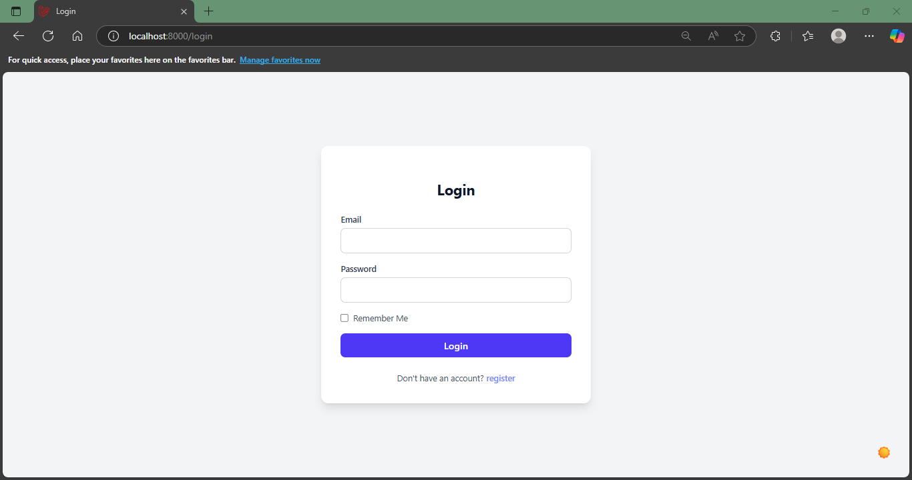

# to do app (Laravel + Livewire)

---

[Screenshots](#screenshots)

---

## Built With

 MYSQL 

 Laravel

 Blade  

 Livewire 

 Tailwind 

 AlpineJs 

---

## Features

### Backend 
- **Authentication** – login, registration, remember me, form validation, without any packages.
- **Middleware Authorization** – user access control to auth pages and dashboard. Each user have access to their own dshbaord.
- **Eloquent ORM CRUD** – Create, Read, Update, Delete, for folders and their tasks. Also task status (complete, incomplete) is included.
  
### Frontend 
- **Blade components** - all the UI pieces turned into components.
- **Tailwind CSS** - used for responsive, modern and user-friendly styling.
- **Alpine.js** - used for theme switching (dark and light mode).
- **Real-time update** - no page refreshing! All the dashboard operations are toggled via Livewire components.

---

## How to Run the app

```bash
git clone https://github.com/KianHmz/todo-app-laravel-livewire
```

```bash
cp .env.example .env.
php artisan key:generate
```

```bash
composer install
```

```bash
php artisan migrate 
```

```bash
php artisan serve
```

```bash
npm install
npm run dev
```

Visit [http://localhost:8000](http://localhost:8000) in your browser.

---

## Screenshots




